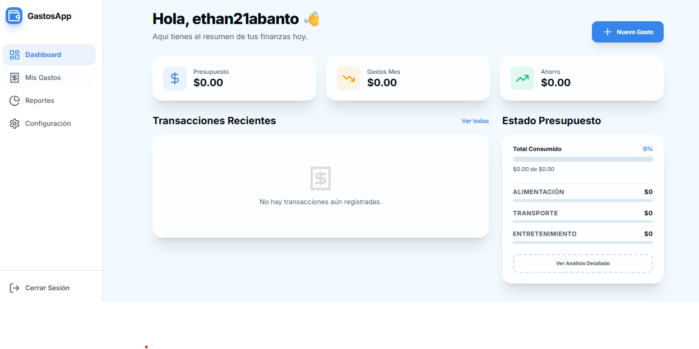

  

  <h1>GastosApp - Smart Expense Tracker 🚀</h1>
  
  

    <strong>Gestiona tus gastos con facilidad utilizando Inteligencia Artificial y escaneo OCR.</strong>
  

  

    <a href="https://expense-tracker-ocr-jpmz.onrender.com"><b>🌍 Ver Proyecto en Vivo</b></a>
  

---

GastosApp es una plataforma moderna diseñada para automatizar el registro de tus finanzas. Gracias a su integración con **OpenAI Vision**, elimina la necesidad de ingresar datos manualmente: simplemente sube o escanea tu recibo y la IA extraerá todos los datos.

## ✨ Características Principales

- **🤖 OCR con IA**: Escanea recibos o tickets. GPT-4o-mini extraerá automáticamente el comercio, monto, fecha, categoría y el desglose de artículos.
- **📊 Dashboard Dinámico**: Control en tiempo real de tu presupuesto, gastos mensuales, ahorros y transacciones recientes.
- **📈 Reportes Visuales**: Gráficos interactivos para entender en qué categorías gastas más.
- **📱 Responsive & Glassmorphism**: Diseño premium e intuitivo construido con Tailwind CSS.
- **🔒 Privacidad y Seguridad**: Las rutas backend están protegidas con validación de origen.

---

## ⚠️ Base de Datos Temporal (Plan Gratuito Render)

Actualmente, este proyecto está configurado y desplegado usando la **Capa Gratuita de Base de Datos PostgreSQL en Render**.

> [!WARNING]  
> Render elimina las bases de datos del plan gratuito automáticamente a los **90 días de su creación**.

### 🔄 Cómo Migrar a una Base de Datos Permanente
Para conservar tus datos indefinidamente, te sugerimos cambiar a proveedores que alojan PostgreSQL de forma gratuita permanente, como **Supabase** o **Neon.tech**. 

**No tienes que tocar ni una sola línea de código, solo seguir estos pasos:**
1. Crea una cuenta gratuita en [Neon.tech](https://neon.tech/) o [Supabase](https://supabase.com/).
2. Crea un proyecto nuevo en su panel de control y copia tu nueva URL de conexión (`postgresql://...`).
3. Ve a tu aplicación en el dashboard de Render (`expense-tracker-ocr`).
4. Entra a la pestaña **Environment**.
5. Edita el valor de la variable de entorno `DATABASE_URL` y pega la nueva URL de Supabase/Neon.
6. Dale a "Save Changes". Render reiniciará la app conectada a la nueva base segura y permanente.

